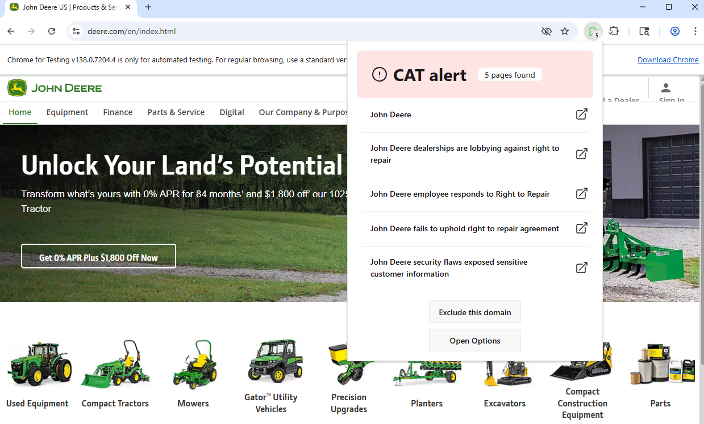
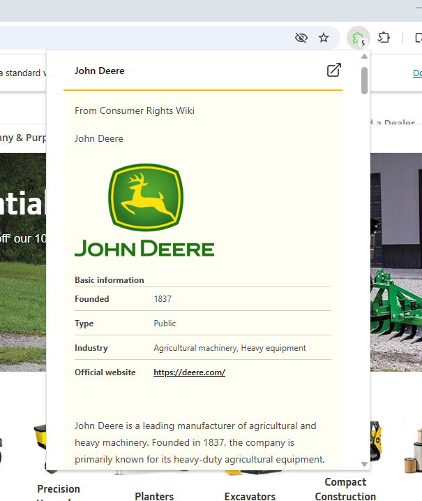

# CAT-says-no

Get alerts if the website you are browsing may be linked to an entry on the Consumer Action Taskforce

CAT-says-no is a browser extension that alerts you if the website you're currently visiting may be linked to an article on the Consumer Action Taskforce Wiki. It provides a plugin system that allows the community to extend the supported websites and search logic.

## Features

- Fetches data directly from the Consumer Action Taskforce Wiki
- Plugin system for data sources, metadata collection and search
    - Remotely hosted plugins
    - Secure, isolated execution environment
    - Auto-updating
    - Enable/disable plugins
    - Easily add custom or community-provided plugins
    - Signature validation for plugin updates (coming soon)
- Built-in Wiki reader for found entries (powered by Readability.js)

## Browser Support

| Browser | Status                                            |
| ------- | ------------------------------------------------- |
| Chrome  | ✅ Recommended                                     |
| Firefox | ⚠️ Partial, experimental                           |
| Safari  | 🛑 Not supported (community contributions welcome) |


## Screenshots




## Getting started

### Installation

> Note: The extension is under active development and must be built from source.

Please use Chrome for now. Firefox may not work and proper support for it will be added at a later date.

Firefox for Android currently has limited support for extensions. If the extension can be reasonably modified to work with it, an attempt for it might be made.

Safari support will have to come solely from community contributions.

### Requirements

- [NodeJS](https://nodejs.org/en/download/)

### Build Steps

Clone the repo and install dependencies:

```bash
npm install
```

Bundle required assets:

```bash
npm run bundle:plugin
npm run bundle:linkedom
```

Build the extension:

```bash
npm run build
# or for Firefox:
npm run build:firefox
```

Start a simple file server (required temporarily while installing):

```bash
npm run serve
```

### Adding the extension to your browser

#### Chrome

- Open `chrome://extensions`
- Enable developer mode
- Click Load Unpacked
- Select the `.output/chrome-mv3` folder

#### Firefox

> ⚠️ Firefox support is experimental and may break.

- Open `about:debugging#/runtime/this-firefox`
- Click `Load Temporary Add-on`
- Select the `.output/firefox-mv2/manifest.json` file

### Verify that plugins loaded correctly

Once installed, open the extension's options page.
You should see the default plugins listed there.

## Development

Chrome version 137 removed the flag that allowed loading extensions from the command line.  
[Chrome for Testing](https://developer.chrome.com/blog/chrome-for-testing) is needed now if you don't want to manually install the extension every time.

Install it:

```bash
npx @puppeteer/browsers install chrome@stable
```

Replace the Chrome executable path in `wxt.config.ts` with the one downloaded.

Bundle `linkedom` once

```bash
npm run bundle:linkedom
```

Bundle plugins (on initial setup or **plugin code changes**):

```bash
npm run bundle:plugin
```

Start the file server

```bash
npm run serve
```

Run the development server

```bash
npm run dev
```

Note: The easiest way to reload plugins is to restart the development server.

## Plugin Development

Thinking about writing a plugin? Check out [Authoring Plugins](./docs/plugins.md)

## Known issues

- The extension always logs the following error to the console:

    ```
    Unchecked runtime.lastError: The page keeping the extension port is moved into back/forward cache, so the message channel is closed.
    ```

    Not sure if this is fixable (at least while using `webext-bridge`). The `onMessage` function seems to always trigger this if it is placed in a content script.

- Firefox does not fully work during development because it uses Manifest V2 instead of V3, which the final build requires. https://github.com/wxt-dev/wxt/issues/230#issuecomment-1806881653

- During dev/on chrome for testing, `browser.tabs.create` with `active: false` does not open the tab in the background. This seems to be a chrome issue, but we should revisit the underlying logic anyways.

## TODO

- [x] (Security) The Wiki reader is just pulling the content from the wiki, passing it into Readability.js, and then inserts it into the DOM. We should sanitize this content using DOMPurify.
- [x] (Security) The Options page uses shiki for syntax highlighting the plugin config. We should sanitize this content using DOMPurify.
- [x] Dynamic plugin loading -> move away from using `browser.runtime.reload`
- [x] (Security) Add signature validation to plugin updates so plugins can only be updated if the signature is valid.
- [x] Add documentation for plugins -> [docs](./docs/plugins.md)
- [x] Add proper styling for reader mode e.g. https://oxal.org/projects/sakura/ -> solved by using tailwind typo
- [ ] Better default plugins.
- [ ] Error handling - there are a ton of places where errors cause the whole extension to become unuseable.
- [ ] logging
- [ ] Have someone that actually knows crypto look over the implementation + do some code cleanup.
- [ ] Evaluate if we should move from simple numbers to a proper versioning system for plugins.
- [ ] Implement offscreen documents or sandboxed pages for Chrome, and use background pages for Firefox.
- [ ] Data plugins are currently disabled until offscreen documents or sandboxed pages are implemented.
- [ ] Figure out how dismissing should behave from a user perspective. For example, if a user is on `youtube.com` and dismisses an alert, they likely want it hidden for that site. However, on a marketplace like Amazon, they probably want to be alerted on all listing pages. Additionally, all matches are currently shown. On Amazon, this means that every product page shows matches related to Amazon in general, not the specific product. There should possibly be an option to ignore specific matches.
- [ ] Workflows for releases / linting

## FAQ

- When will this extension be released on the extension stores?
    - Depends, at the moment it is still in development and is not ready for release. Since we are executing remote code, which Manifest V3 was supposed to prevent, it may not be allowed to be released in the chrome webstore. In the future we will most likely need a separate build that has the default plugins bundled with the extension and does not allow running remote code. (Might be wrong on this one though)
- Why are plugins split into different types, would it not be better to allow plugin authors to write a single plugin that can be used for search, metadata, etc?
    - The original intent was to provide a clear separation between the different types of plugins, mainly to allow for more modularity on the enduser side. However this does not seem to really bring much of a benefit in practice, it may be better to just add a toggle per type that a plugin ships with, on the options page. Tldr. this will very likely change in the future.
- Why Manifest V3?
    - Because it is, for the better or the worse, the future. There is simply no need to support Manifest V2 anymore since support has already been removed from Chrome.
