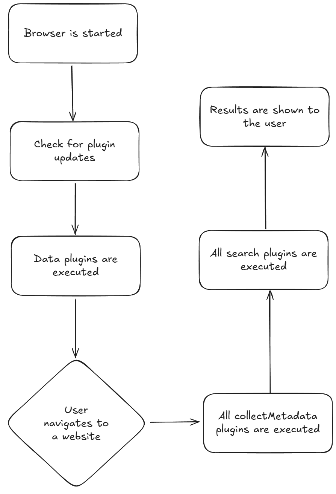

# Authoring Plugins

This guide will provide an overview of the plugin system and guide you through the steps necessary to create a plugin.

See the plugin folder for examples.

## Flow



## Writing a Plugin

Plugins are written in JavaScript, types are exported from the `src/lib/plugins/types.ts` file.

Each Plugin exists of the following files:

- a `json` file containing the plugin config
- a `js` file containing the plugin logic
- an image file containing the plugin icon

Take a look at the [plugin script](../scripts/export-plugin.ts) that outputs our plugins.

### Config

The config file must be a valid JSON file. However the best way to write a plugin config is to write to utilize the `PluginConfig` type via TypeScript and just write the config directly to a file. If you do not use the provided type, check out [pluginConfigSchema](../src/lib/plugins/plugin-config.ts) for what each field means and which fields are required.

Example `config.json`

```json
{
    "id": "ca72f219-a2a3-4f77-8481-99771f6ec860",
    "type": "search",
    "author": "John Doe",
    "allowDomains": [],
    "changelog": {},
    "description": "Default simple search plugin",
    "iconUrl": "http://localhost:8080/dist/search-plugin/icon.png",
    "name": "Search Plugin",
    "pluginPublicKey": "publicKey",
    "pluginSignature": "signature",
    "version": 1,
    "scriptUrl": "http://localhost:8080/dist/search-plugin/index.js",
    "sourceUrl": "http://localhost:8080/dist/search-plugin/config.json",
    "authorUrl": "http://192.168.178.21:8080",
    "repositoryUrl": "http://192.168.178.21:8080"
}
```

<br>

Example `config.ts`

```ts
import type { PluginConfig } from '...../plugin-config';
import fs from 'fs';

const pluginConfig: PluginConfig = {
    id: 'ca72f219-a2a3-4f77-8481-99771f6ec860',
    type: 'search',
    author: 'John Doe',
    allowDomains: [],
    changelog: {},
    description: 'Default simple search plugin',
    iconUrl: 'http://192.168.178.21:8080',
    name: 'Search Plugin',
    pluginPublicKey: 'publicKey',
    pluginSignature: 'signature',
    version: 1,
    scriptUrl: 'http://192.168.178.21:8080/dist/bundle.js',
    sourceUrl: 'http://192.168.178.21:8080/dist/config.json',
    authorUrl: 'http://192.168.178.21:8080',
    repositoryUrl: 'http://192.168.178.21:8080',
};

fs.writeFileSync('./config.json', JSON.stringify(pluginConfig, null, 2));
```

### Signatures

The `pluginSignature` and `pluginPublicKey` should be set whenever you deploy a new version of your script (this is not required during development). The purpose of these fields is to verify that a plugin update was made by the same individual that developed the original plugin. This prevents somebody from hijacking your plugin without having access to your public private keypair. Installing/updating are not possible if the signature does not match. Here is an example script showing you how to generate these values.

Generate base64 encoded keypair. [generate-keypair.ts](../scripts/generate-keypair.ts)  
(see `.tmp` folder for output, make sure to store your private and public key somewhere safe and delete the `.tmp` folder afterwards)

```bash
npm run generate:keypair
```

Example for generating a plugin signature

```ts
// load keys
const privateKey = atob(process.env.PRIVATE_KEY);
const publicKey = atob(process.env.PUBLIC_KEY);

// load the final plugin code
const data = await fs.readFile(`dist/${plugin}/index.js`);

// generate signature
const sign = crypto.createSign('sha256');
sign.update(data);
sign.end();
const signature = sign.sign(privateKey);

// add to config
config.pluginPublicKey = btoa(publicKey);
config.pluginSignature = signature.toString('base64');
```

### Plugin code

The plugin code must be a valid JavaScript file that sets the `search` or `collectMetadata` on the globalThis object.

```js
globalThis.search = ({ url, document, data, metadata }) => {
    const urlObject = new URL(url);
    const domain = urlObject.hostname;
    return data.filter((page) => page.title.toLowerCase().includes(domain));
};
```

```js
globalThis.collectMetadata = ({ url, document }) => {
    const urlObject = new URL(url);

    const checkIfShopifyStore = (document) => {
        if ([...document.querySelectorAll('script')].some((script) => script.innerHTML.includes('window.Shopify = window.Shopify || {};'))) {
            return true;
        }
    };

    return {
        shop: checkIfShopifyStore(document) ? 'shopify' : undefined,
        isProductPage: false,
        vendor: undefined,
        productName: undefined,
        custom: {},
    };
};
```
